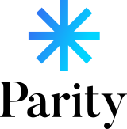

<br>

<p align="center">
  <picture>
    <source media="(prefers-color-scheme: dark)" srcset="assets/svg/logo_vl.svg">
    
  </picture>
</p>

<br>

<p align="center">
  
  
  
  <br>
  
  
  
  
</p>

<br>

## Parity

> **Parity** (codename `Xi`): from *covered interest rate parity*, the arbitrage-free forward rate at the heart of the engine. Know exactly how much a currency move can cost your margin, and what to do about it.

Parity is a currency risk decision engine for importers and e-commerce merchants. An SME that buys in `USD` or `EUR` and resells 60 to 120 days later can watch its entire margin evaporate if the currency rises between order and delivery. Parity quantifies that risk through `Monte Carlo` simulation, produces a **Vulnerability Score** (0 to 100), then recommends the optimal hedge (forward contract, option, or collar) with its cost and benefit fully quantified.

The engine combines near-institutional modeling: `GBM` diffusion with a drift set by interest rate parity (`CIP`), `Heston` stochastic volatility (full-truncation Euler scheme) that produces an endogenous smile, `Student-t` fat tails and `Merton` jumps, `Sobol` quasi-random sampling with antithetic variates. Volatility is estimated by `historical`, `EWMA`, or `GARCH(1,1)` (maximum likelihood), and portfolio correlations by `DCC-GARCH` (Engle dynamic conditional correlations).

The hedging decision relies on an optimal ratio via `CVaR` minimization, `Garman-Kohlhagen` option pricing (or smile-consistent `Monte Carlo` pricing under Heston), `Kupiec (POF)` backtesting, deterministic stress tests plus historical replay (`2008 crisis`, `COVID-19`), a versioned `Office des Changes` rules engine, and an inter-run monitoring system with dispatchable alerts (`console`, `webhook`, `email`). Everything is exposed through a hardened `FastAPI` service and persisted on `PostgreSQL`, `MongoDB`, and `Neo4j`.

## Table of Contents

- [Features](#features)
- [Requirements](#requirements)
- [Quick Start](#quick-start)
- [Core API](#core-api)
- [Environment](#environment)
- [Architecture](#architecture)
- [License](#license)

## Features

The **quantitative core** (`core/`) simulates the delivery-date exchange rate over hundreds of thousands of scenarios (up to `1,000,000` in about 1 s, NumPy vectorized). The default process is a risk-neutral `GBM` whose drift respects **covered interest rate parity** (`E[S_T] = spot * exp((r_d - r_f) * T)`), with options for **Heston stochastic volatility**, the `Student-t` distribution (fat tails), and `Merton` jump-diffusion with a martingale compensator. Volatility comes from a `historical`, `EWMA` (RiskMetrics), or `GARCH(1,1)` estimator calibrated by `MLE`, with automatic fallback. The margin distribution yields percentiles, loss probability, `Expected Shortfall / CVaR` (computed in `O(n)` via `np.partition`), and a **Vulnerability Score** with a risk level.

The **hedging engine** turns risk into a decision: optimal hedge ratio via `CVaR` minimization, a quantified comparison of `Unhedged / Forward / Option / Collar` (`Garman-Kohlhagen` pricing, zero-cost collar solved by `Brent`, or smile-consistent `Monte Carlo` pricing under Heston), and theoretical versus quoted forward rate. The **portfolio** module aggregates several multi-currency orders with per-currency netting, correlated simulation (`Cholesky` with eigenvalue-clipping fallback), portfolio `VaR` and `CVaR`, diversification benefit, and dynamic `DCC-GARCH` correlations.

**Validation and governance** are built in: `VaR` model backtesting via the `Kupiec (POF)` test, deterministic stress tests (parameterized shocks) and **real historical replay** of the `2008` and `COVID-19` crises, plus an analytical reverse stress test (the move that wipes out the margin). A versioned, data-driven **Office des Changes** rules engine assesses hedging eligibility (indicative). The **monitoring** layer compares each new run against the previous one (risk escalation, score jump, spot move) and dispatches typed alerts through `console`, `webhook`, or `email SMTP` sinks.

The whole system is exposed through a hardened **FastAPI** service (`API key`, anti-`SSRF` host allowlist, token-bucket `rate limiting`, security headers, streamed response cap), persisted on three databases (`PostgreSQL` for structured history, `MongoDB` for full result documents, `Neo4j` for the currency exposure graph), and enriched by an optional **AI narrative** via `Groq / LLaMA 3.3`. Test coverage: **361 tests, 98%**.

## Requirements

**Core and API**

| Package | Version |
|---|---|
| Python | 3.11+ |
| NumPy | 1.26+ |
| SciPy | 1.13+ |
| pandas | 2.2+ |
| FastAPI | 0.115+ |
| Uvicorn | 0.34+ |
| pydantic | 2.10+ |

**Technology Stack**

| Component | Role |
|---|---|
| NumPy, SciPy, pandas | Vectorized quantitative engine (Monte Carlo, Heston, GARCH, DCC) |
| FastAPI plus Uvicorn | Secured REST API |
| Frankfurter (ECB) | Historical exchange rate source |
| PostgreSQL 17+ | Structured simulation history (Supabase in production) |
| MongoDB 6+ | Full result documents (Atlas in production) |
| Neo4j 5+ | Currency exposure graph (Aura in production) |
| Groq API, LLaMA 3.3 | AI narrative for risk reports (optional) |
| python-dotenv | `.env` configuration loading (optional) |
| pytest | Test suite (361 tests, 98% coverage) |

## Quick Start

**Step 1: Clone and configure**

```bash
git clone <repo-url> parity
cd parity
cp .env.example .env
```

The engine runs **with zero configuration** (free ECB source, in-memory storage). All `.env` variables are optional; fill them in to enable persistence, the AI narrative, or authentication.

**Step 2: Install dependencies**

```bash
python -m venv .venv
source .venv/bin/activate          # Windows: .venv\Scripts\activate
pip install -e ".[api,db,ai,dotenv,dev]"
```

**Step 3: Run the test suite**

```bash
pytest -q                          # 361 tests
```

**Step 4: Start the API**

```bash
uvicorn api.main:app --host 0.0.0.0 --port 8000
```

The API is live at `http://localhost:8000`. Swagger UI at `/docs`.

**Step 5: Run a simulation**

```bash
curl -X POST http://localhost:8000/api/v1/simulations \
  -H "Content-Type: application/json" \
  -d '{
    "order": {
      "amount_foreign": 200000, "foreign_currency": "USD", "domestic_currency": "EUR",
      "delivery_date": "2026-10-01", "target_margin_pct": 0.15,
      "domestic_rate": 0.021, "foreign_rate": 0.043
    },
    "options": { "market_model": "heston", "volatility_model": "garch" }
  }'
```

## Core API

REST root: `/api/v1`. When `XI_API_KEY` is set, every request requires the `X-API-Key` header (except `/health`, *public*).

**Simulations and hedging**

| Method | Endpoint | Description |
|---|---|---|
| GET | `/health` | Service status and version. *public* |
| POST | `/api/v1/simulations` | Risk simulation, hedging, instrument comparison, inter-run alerts. Options: `market_model` (`gbm` or `heston`), `volatility_model`, `return_distribution`, `jumps`, `sampling_method`. `persist` and `narrative` optional |
| GET | `/api/v1/simulations/history` | Simulation history (currency filters, `limit`) |
| GET | `/api/v1/simulations/{record_id}` | Fetch a persisted simulation |
| GET | `/api/v1/exposure` | Currency exposure graph (Neo4j) |

**Portfolio, stress, compliance, backtest**

| Method | Endpoint | Description |
|---|---|---|
| POST | `/api/v1/portfolio/simulations` | Multi-currency portfolio risk (netting, VaR/CVaR, diversification, DCC-GARCH) |
| POST | `/api/v1/stress-tests` | Deterministic scenarios, 2008/COVID replay, reverse stress test |
| POST | `/api/v1/compliance` | Office des Changes assessment (indicative, versioned) by operation type |
| POST | `/api/v1/backtests/var` | VaR model backtesting via the Kupiec (POF) test |

## Environment

All variables are **optional** and prefixed with `XI_`. Without them, Parity uses the ECB source and in-memory storage. The full list lives in [`.env.example`](.env.example).

**Application and security**

| Variable | Default | Description |
|---|---|---|
| `XI_API_KEY` | | When set, the `X-API-Key` header becomes mandatory |
| `XI_ALLOWED_FX_HOSTS` | `api.frankfurter.dev` | Data host allowlist (anti-SSRF) |
| `XI_HTTP_TIMEOUT_SECONDS` | `10.0` | Data call timeout |
| `XI_RATE_LIMIT_PER_SECOND` | `10.0` | Max request rate to the rate provider |
| `XI_CACHE_TTL_SECONDS` | `3600` | Exchange rate cache lifetime |

**Persistence (optional)**

| Variable | Default | Description |
|---|---|---|
| `XI_POSTGRES_DSN` | | PostgreSQL DSN for structured history |
| `XI_MONGODB_URI` | | MongoDB URI for result documents |
| `XI_MONGODB_DATABASE` | `xi` | Mongo database name |
| `XI_NEO4J_URI` | | Neo4j URI for the exposure graph |
| `XI_NEO4J_USERNAME`, `XI_NEO4J_PASSWORD` | | Neo4j credentials |
| `XI_NEO4J_DATABASE` | `neo4j` | Neo4j database (the instance ID on Aura) |

**AI (optional)**

| Variable | Default | Description |
|---|---|---|
| `XI_GROQ_API_KEY` | | Groq key for the AI narrative |
| `XI_GROQ_MODEL` | `llama-3.3-70b-versatile` | Groq model |

## Architecture

Parity follows a strict hexagonal architecture with no circular dependencies:

| Package | Role | Depends on |
|---|---|---|
| `core/models` | Domain and pure computation (Monte Carlo, Heston, GARCH, DCC, hedging, scoring, stress, compliance) | none |
| `core/io` | FX data and network adapters (Frankfurter, secure session, cache, rate limiter) | `core/models` |
| `core/app` | Orchestration (`MarginRiskEngine`, `PortfolioRiskEngine`) | `core` |
| `db` | Persistence (in-memory, PostgreSQL, MongoDB, Neo4j, composite) | `core` |
| `ai` | AI narrative (Groq, import-guarded) | `core` |
| `api` | HTTP layer (FastAPI) plus `api/monitoring` (scheduler and alert sinks) | `core`, `db`, `ai` |

The computation core (`core`) knows nothing about the network, the databases, or the API, so it is fully testable in isolation. Every external dependency (rates, databases, LLM) is injected through *ports* (Protocols), which makes it possible to plug in a new source, for example **Bank Al-Maghrib** for the `MAD` (not covered by the ECB), without touching the engine.

## License

Proprietary project, all rights reserved. Contact the maintainer for any use.
