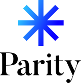
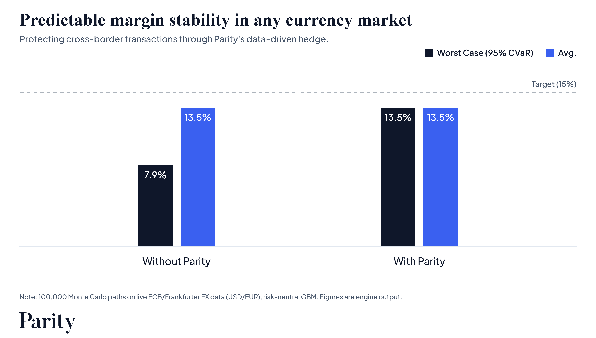

<br>

<p align="center">
  <picture>
    <source media="(prefers-color-scheme: dark)" srcset=".github/assets/svg/logo_2.svg">
    
  </picture>
</p>

<br>

<p align="center">
  <a href="https://github.com/zak-li/Parity/releases"></a>
  <a href="LICENSE"></a>
  <a href="https://github.com/zak-li/Parity/actions/workflows/ci.yml"></a>
  <a href="https://github.com/zak-li/Parity/issues"></a><br>
  <a href="https://github.com/zak-li/Parity/commits/main"></a>
  <a href="https://docs.pytest.org/"></a>
</p>

<br>

## Parity

> **Parity** (codename `Xi`): a currency risk decision engine for importers and e-commerce merchants. It quantifies FX exposure, scores vulnerability, and recommends the optimal hedge directly from the numbers.

Parity quantifies FX exposure by `Monte Carlo` simulation, produces a **Vulnerability Score** from 0 to 100, and recommends the optimal hedge such as a forward, an option, or a collar, with its cost and benefit fully quantified.

<br>

<p align="center">
  <picture>
    <source media="(prefers-color-scheme: dark)" srcset="charts/parity_before_after_dark.png">
    
  </picture>
</p>

<br>

## Table of Contents

- [Features](#features)
- [Dependencies](#dependencies)
- [Quick Start](#quick-start)
- [Core API](#core-api)
- [Options](#options)
- [Environment](#environment)
- [License](#license)

## Features

The core simulates the delivery-date exchange rate by `Monte Carlo` (`GBM` with covered interest rate parity, optional `Heston`, `Student-t`, and `Merton` jumps), with volatility from `historical`, `EWMA`, or `GARCH(1,1)`. It turns the margin distribution into percentiles, loss probability, Expected Shortfall (`CVaR`), and a Vulnerability Score, then compares an unhedged position against a forward, an option, and a collar to recommend the optimal hedge.

It also aggregates multi-currency portfolios and runs stress tests, `VaR` backtesting, and Office des Changes compliance checks. Everything is exposed through a hardened `FastAPI` service with optional `PostgreSQL`, `MongoDB`, and `Neo4j` persistence and a `Groq` AI narrative.

## Dependencies

The engine core requires the following packages:

| Package | Version |
|---|---|
| Python | 3.11+ |
| NumPy | 2.4+ |
| SciPy | 1.17+ |
| pandas | 3.0+ |
| requests | 2.34+ |

The following are optional and enable extra capabilities:

| Component | Role |
|---|---|
| FastAPI + Uvicorn | Hardened REST API service |
| SQLAlchemy + psycopg2 | PostgreSQL structured history |
| pymongo | MongoDB result documents |
| neo4j | Currency exposure graph |
| groq | AI narrative generation |
| python-dotenv | `.env` file loading |

## Quick Start

**Step 1: Clone the repository**

```bash
git clone https://github.com/zak-li/Parity.git
cd Parity
```

**Step 2: Create the environment file**

```bash
cp .env.example .env
```

All variables are optional. The engine runs with zero configuration using free ECB rates and in-memory storage. Fill in `.env` to enable persistence, the AI narrative, or API authentication.

**Step 3: Create a virtual environment and install**

```bash
python -m venv .venv
source .venv/bin/activate          # Windows: .venv\Scripts\activate
pip install -e ".[api,db,ai,dotenv,dev]"
```

**Step 4: Verify the install with the test suite**

```bash
pytest -q
```

**Step 5: Start the API**

```bash
uvicorn api.main:app --host 0.0.0.0 --port 8000
```

The API is live at `http://localhost:8000` and the interactive documentation at `/docs`.

**Step 6: Send a first request**

```bash
curl -X POST http://localhost:8000/api/v1/simulations \
  -H "Content-Type: application/json" \
  -d '{"order": {"amount_foreign": 200000, "foreign_currency": "USD",
       "domestic_currency": "EUR", "delivery_date": "2026-10-01",
       "target_margin_pct": 0.15, "domestic_rate": 0.021, "foreign_rate": 0.043}}'
```

## Core API

The API is rooted at `/api/v1` with Swagger docs at `/docs`. Every route requires the `X-API-Key` header once `XI_API_KEY` is configured, except the public `/health` check.

These endpoints run simulations and expose their results:

| Method | Endpoint | Description |
|---|---|---|
| GET | `/health` | Service status and version. *public* |
| POST | `/api/v1/simulations` | Risk simulation, hedging decision, instrument comparison, alerts |
| GET | `/api/v1/simulations/history` | Persisted simulation history with currency filters |
| GET | `/api/v1/simulations/{id}` | Fetch a single persisted simulation |
| GET | `/api/v1/exposure` | Currency exposure graph |

These endpoints cover portfolio risk, hedging tools, stress testing, compliance, and backtesting:

| Method | Endpoint | Description |
|---|---|---|
| POST | `/api/v1/portfolio/simulations` | Multi-currency portfolio risk with per-currency CVaR attribution |
| POST | `/api/v1/ladder/simulations` | Cashflow ladder: multi-date exposure and layered hedging |
| POST | `/api/v1/hedge/greeks` | Closed-form FX option Greeks (Garman-Kohlhagen) |
| POST | `/api/v1/stress-tests` | Deterministic and historical stress tests |
| POST | `/api/v1/compliance` | Office des Changes assessment (indicative) |
| POST | `/api/v1/backtests/var` | VaR model backtesting with the Kupiec test |
| POST | `/api/v1/backtests/es` | Expected Shortfall backtest (Acerbi-Szekely) |

## Options

The `options` block of `POST /simulations` selects the modeling method. All fields are optional and default to the fastest baseline.

| Option | Values | Default |
|---|---|---|
| `market_model` | `gbm`, `heston` | `gbm` |
| `volatility_model` | `historical`, `ewma`, `garch` | `historical` |
| `return_distribution` | `normal`, `student_t` | `normal` |
| `sampling_method` | `pseudo_random`, `sobol` | `pseudo_random` |
| `jumps` | object with `intensity_annual`, `mean_log_jump`, `std_log_jump` | none |

## Environment

These variables are all optional and share the `XI_` prefix. The complete reference is in [`.env.example`](.env.example).

| Variable | Default | Description |
|---|---|---|
| `XI_API_KEY` | | When set, the `X-API-Key` header becomes mandatory |
| `XI_API_RATE_LIMIT_PER_SECOND` | `25` | Inbound per-client rate limit |
| `XI_API_RATE_LIMIT_BURST` | `50` | Inbound per-client burst size |
| `XI_API_MAX_CONCURRENCY` | `8` | Max simultaneous requests before `503` |
| `XI_API_REQUEST_TIMEOUT_SECONDS` | `30` | Request timeout before `504` |
| `XI_ALLOWED_FX_HOSTS` | `api.frankfurter.dev` | Data host allowlist (anti-SSRF) |
| `XI_HTTP_TIMEOUT_SECONDS` | `10.0` | Data call timeout |
| `XI_RATE_LIMIT_PER_SECOND` | `10.0` | Max request rate to the rate provider |
| `XI_CACHE_TTL_SECONDS` | `3600.0` | Exchange rate cache lifetime |
| `XI_POSTGRES_DSN` | | PostgreSQL DSN for structured history |
| `XI_MONGODB_URI` | | MongoDB URI for result documents |
| `XI_MONGODB_DATABASE` | `xi` | Mongo database name |
| `XI_NEO4J_URI` | | Neo4j URI for the exposure graph |
| `XI_NEO4J_USERNAME`, `XI_NEO4J_PASSWORD` | | Neo4j credentials |
| `XI_NEO4J_DATABASE` | `neo4j` | Neo4j database (the instance ID on Aura) |
| `XI_GROQ_API_KEY` | | Groq key for the AI narrative |
| `XI_GROQ_MODEL` | `llama-3.3-70b-versatile` | Groq model |

## License

This project is licensed under the [GNU Affero General Public License v3.0](LICENSE).
